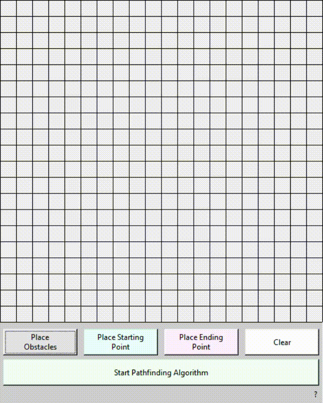
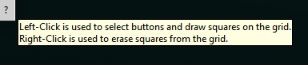

# A-Star-Visualization

## Description

An interactive visualization of the A\* pathfinding algorithm.

Allows a user to place obstacles, a starting point, and an ending
point anywhere on a grid of squares and find the best path between
those two points (if one exists).

## Demo

A tooltip shows the simple controls needed for the application.

